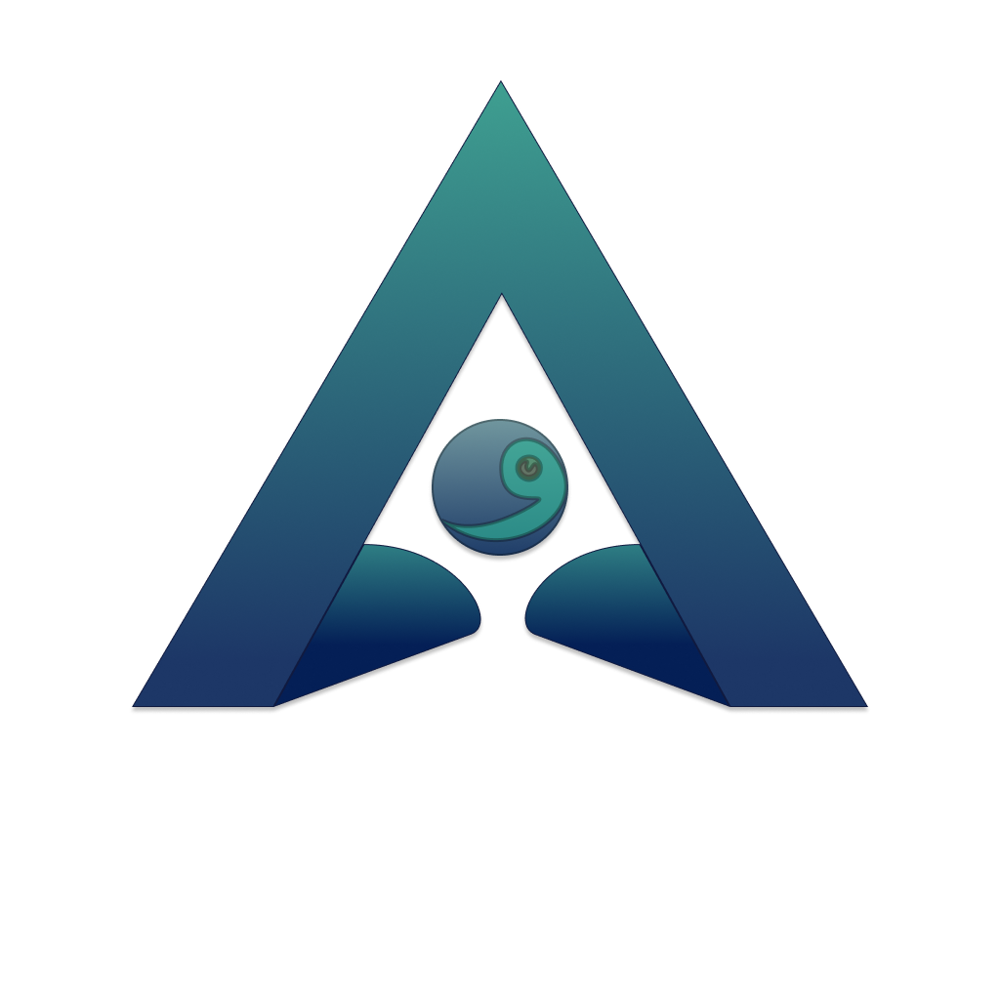
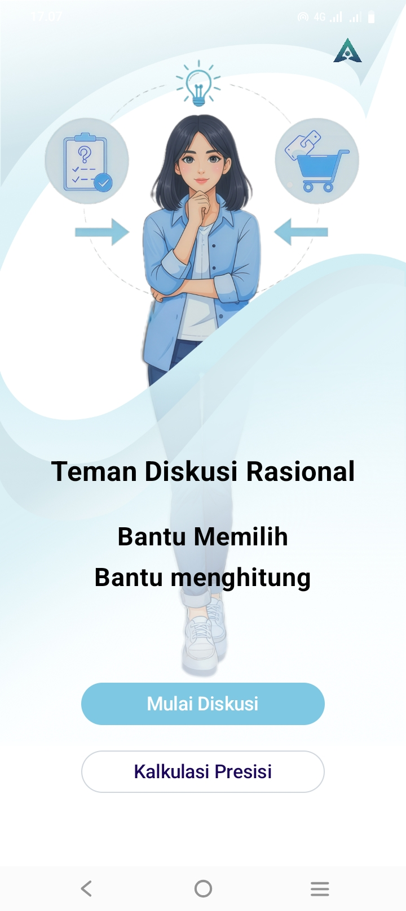
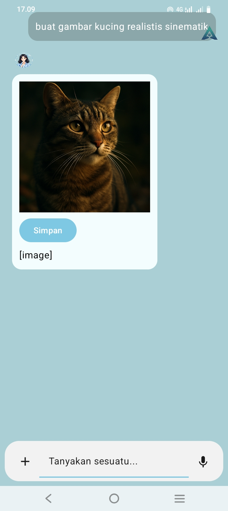
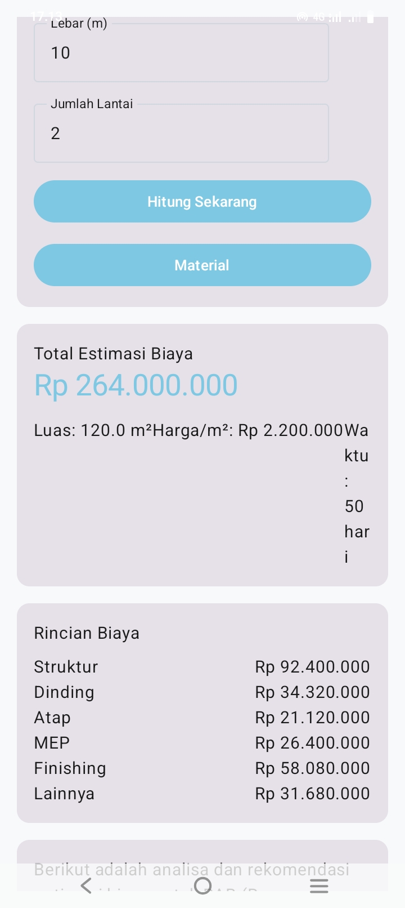
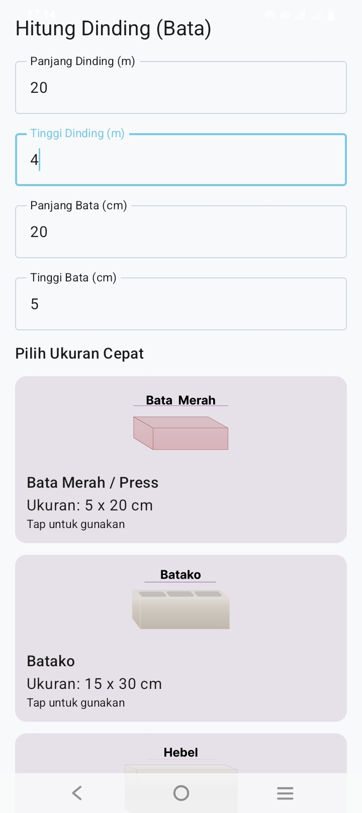
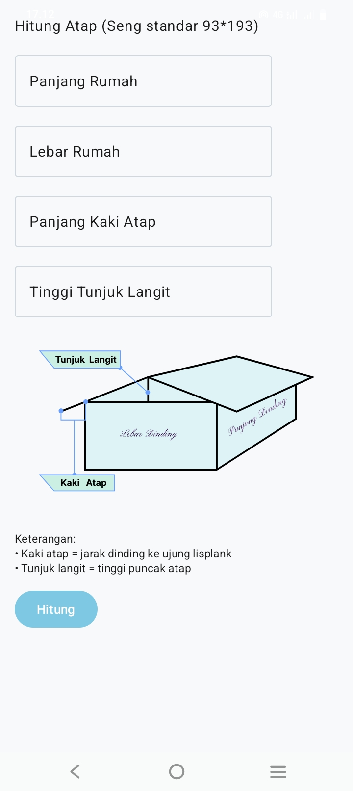
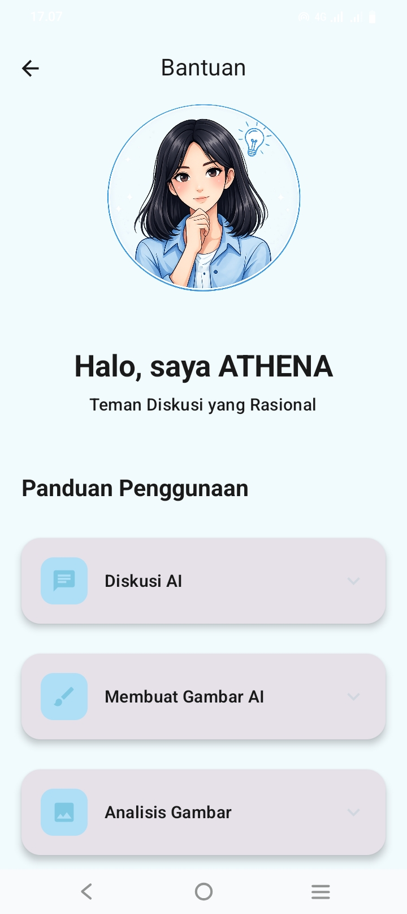
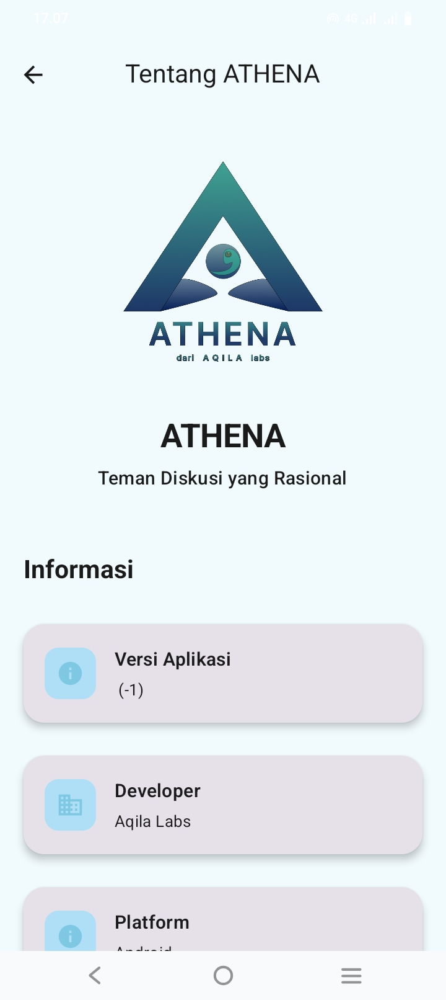
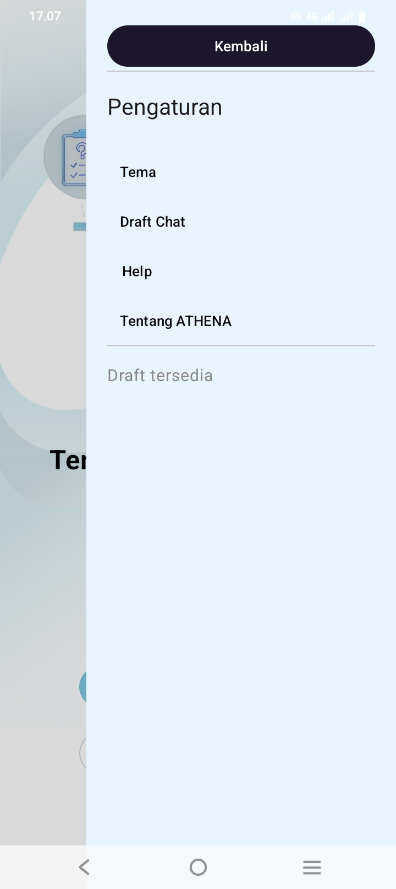

# public-readme

# ATHENA

  

<h1 align="center">ATHENA</h1>

  Intelligent AI Assistant for Android

  Developed by <strong>AQILA Labs</strong>

---

ATHENA adalah aplikasi Android berbasis **Artificial Intelligence (AI)** yang dikembangkan oleh **AQILA Labs**.

Dirancang sebagai asisten cerdas yang menggabungkan kemampuan percakapan AI, analisis dokumen, analisis gambar, serta **Kalkulasi Presisi** dalam satu aplikasi dengan antarmuka modern berbasis **Jetpack Compose**.

ATHENA bertujuan membantu pengguna memperoleh informasi, meningkatkan produktivitas, serta menyelesaikan berbagai kebutuhan analisis dan perhitungan teknis secara cepat, akurat, dan mudah digunakan.

> **Status:** ATHENA saat ini berada pada tahap akhir pengembangan dengan fokus pada penyelesaian petunjuk penggunaan, halaman dukungan, lisensi, pengujian, dan penyempurnaan pengalaman pengguna sebelum rilis publik.

---

# Table of Contents

- [Vision](#vision)
- [Core Features](#core-features)
- [Precision Calculator](#precision-calculator)
- [Why ATHENA?](#why-athena)
- [Screenshots](#screenshots)
- [Technology Stack](#technology-stack)
- [Project Architecture](#project-architecture)
- [Development Status](#development-status)
- [Roadmap](#roadmap)
- [License](#license)
- [Contact](#contact)

---

# Vision

ATHENA dikembangkan sebagai platform AI yang tidak hanya berfungsi sebagai chatbot, tetapi juga sebagai asisten produktivitas yang mampu membantu pengguna memahami informasi, menganalisis berbagai jenis data, serta menyelesaikan pekerjaan teknis melalui antarmuka yang sederhana, modern, dan intuitif.

Visi ATHENA adalah menghadirkan pengalaman penggunaan AI yang praktis dalam satu aplikasi Android tanpa harus berpindah ke berbagai layanan yang berbeda.

---

# Core Features

## AI Assistant

ATHENA menyediakan kemampuan percakapan berbasis Artificial Intelligence yang dirancang untuk membantu berbagai kebutuhan sehari-hari.

Fitur meliputi:

- Percakapan berbasis AI
- Tanya jawab
- Ringkasan informasi
- Bantuan penulisan
- Diskusi berbagai topik
- Analisis teks

---

## Document Analysis

Membantu pengguna memahami isi dokumen secara lebih cepat.

Fitur meliputi:

- Analisis PDF
- Ringkasan dokumen
- Ekstraksi informasi
- Identifikasi isi dokumen

---

## Image Analysis

Memungkinkan pengguna memperoleh informasi dari gambar yang diberikan.

Fitur meliputi:

- Analisis gambar
- Deskripsi visual
- Identifikasi objek
- Interpretasi isi gambar

---

# Precision Calculator

Kalkulasi Presisi merupakan salah satu fitur utama ATHENA yang dirancang untuk membantu berbagai kebutuhan perhitungan teknis.

Modul yang tersedia meliputi:

- Perhitungan Rencana Anggaran Biaya (RAB)
- Perhitungan kebutuhan material bangunan
- Perhitungan furniture
- Perhitungan kitchen set
- Estimasi ukuran pekerjaan
- Estimasi kebutuhan material

Fitur ini dikembangkan untuk membantu pengguna memperoleh estimasi yang lebih cepat, praktis, dan konsisten dalam berbagai pekerjaan konstruksi maupun interior.

---

# Why ATHENA?

ATHENA mengintegrasikan berbagai kemampuan AI ke dalam satu aplikasi Android sehingga pengguna tidak perlu berpindah antar aplikasi untuk melakukan berbagai aktivitas.

Keunggulan ATHENA:

- AI Assistant
- Document Analysis
- Image Analysis
- Precision Calculator
- Antarmuka modern berbasis Material Design 3
- Dikembangkan menggunakan Jetpack Compose
- Fokus pada kemudahan penggunaan
- Dirancang untuk produktivitas

---

# Screenshots

Berikut merupakan beberapa tampilan antarmuka ATHENA selama proses pengembangan. Seluruh tampilan dirancang menggunakan **Jetpack Compose** dengan pendekatan **Material Design 3**, berfokus pada kemudahan penggunaan, konsistensi antarmuka, dan pengalaman pengguna yang modern.

---

### Home

Halaman utama ATHENA yang menjadi pusat navigasi menuju seluruh fitur aplikasi, termasuk AI Assistant, Kalkulasi Presisi, bantuan, dan pengaturan.

  

---

### AI Chat

Halaman percakapan utama untuk berinteraksi dengan Artificial Intelligence. Pengguna dapat mengajukan pertanyaan, berdiskusi, meminta ringkasan, maupun memperoleh berbagai informasi secara cepat.

  

---

### Home Chat

Tampilan awal ruang percakapan sebelum percakapan dimulai, menampilkan identitas ATHENA beserta akses cepat ke berbagai fungsi AI.

  

---

### Precision Calculator

Menu utama fitur **Kalkulasi Presisi** yang dirancang untuk membantu berbagai kebutuhan perhitungan teknis dan estimasi pekerjaan.

  

---

### Material Calculator

Modul perhitungan kebutuhan material bangunan untuk membantu estimasi volume pekerjaan dan kebutuhan material secara lebih praktis.

  

---

### Calculator Modules

Daftar berbagai modul perhitungan yang tersedia, seperti material bangunan, furniture, kitchen set, serta modul kalkulasi lainnya yang akan terus dikembangkan.

  

---

### Help Center

Halaman bantuan yang menyediakan petunjuk penggunaan aplikasi, informasi fitur, serta panduan bagi pengguna baru.

  

---

### About

Halaman informasi aplikasi yang berisi profil ATHENA, informasi pengembang, serta identitas AQILA Labs.

  

---

### Settings

Halaman pengaturan untuk menyesuaikan pengalaman penggunaan aplikasi, termasuk tema, preferensi tampilan, dan konfigurasi lainnya.

  

---

# Technology Stack

ATHENA dikembangkan menggunakan teknologi modern Android.

- Kotlin
- Jetpack Compose
- Material Design 3
- Android SDK
- OpenAI API

---

# Project Architecture

ATHENA dibangun menggunakan arsitektur modular sehingga setiap komponen memiliki tanggung jawab yang jelas.

Komponen utama meliputi:

- User Interface
- AI Engine
- Document Processing
- Image Analysis
- Precision Calculator
- Local Storage
- Navigation
- Settings
- Theme System

Pendekatan modular ini memudahkan pengembangan, pemeliharaan, serta penambahan fitur baru di masa mendatang.

---

# Development Status

ATHENA saat ini mendekati tahap akhir pengembangan.

Fokus pengembangan saat ini meliputi:

- Penyempurnaan antarmuka pengguna
- Halaman Petunjuk Penggunaan
- Halaman Dukungan
- Halaman Lisensi
- Optimalisasi performa
- Pengujian akhir
- Persiapan publikasi di Google Play

---

# Roadmap

## Completed

- AI Chat
- Document Analysis
- Image Analysis
- Precision Calculator
- Modern UI
- Theme System

## In Progress

- User Guide
- Support Center
- License Page
- Performance Optimization
- Final Testing

## Planned

- Multi-language Support
- Additional Precision Calculator Modules
- Continuous Improvement
- Feature Expansion

---

# License

Copyright © 2026 AQILA Labs.

Seluruh hak cipta aplikasi ATHENA beserta kode sumber, logo, desain, dokumentasi, dan aset yang terkait merupakan milik AQILA Labs.

Kode sumber yang dipublikasikan melalui repositori ini ditujukan untuk keperluan dokumentasi, pembelajaran, dan portofolio sesuai lisensi yang berlaku.

Dilarang menyalin, memodifikasi, mendistribusikan, atau menggunakan sebagian maupun seluruh bagian proyek ini tanpa izin tertulis dari AQILA Labs, kecuali dinyatakan lain dalam lisensi yang menyertainya.

---

# Contact

**AQILA Labs**

Developer of ATHENA

📧 Email: dev.aqilalabs@gmail.com

---

© 2026 AQILA Labs. All Rights Reserved.
